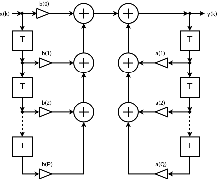

# IIR Filter Implementation

This folder contains an implementation from scratch of an IIR filter.

## FIR Filter

A Infinite Impulse Response (IIR) filter is a filter whose Impulse Response is of infinite duration. 

Mathematically, this can be expressed as follows:

$$
y[n] = b_0x[n] + b_1x[n-1] + b_2x[n-2] + \dots + b_Nx[n-P]
$$

This is equal to:

$$
\sum_{i=0}^{N} b_i x[n-i]
$$

where:

- $x[n]$ is the input signal at time $n$
- $y[n]$ is the output signal at time $n$
- $N$ is the order of the filter
- $b_i$ is the value of the impulse response at time $i$

> [!CAUTION]
> The filter order is the taps minus one. So, for example, a filter of 5th order has 6 taps

> [!TIP]
> $x[n-i]$ are commonly referred as taps

## Computing the impulse response

The only parameters that we need to know to implement a FIR filter are the values of the impulse response. To compute it, we can use the Sinc method, which is already implemented in scikit-learn library ([https://docs.scipy.org/doc/scipy/reference/generated/scipy.signal.firwin.html](https://docs.scipy.org/doc/scipy/reference/generated/scipy.signal.firwin.html)). However, to make everything from scratch, in this repository, we implemented it from scratch. 

## IIR Filter

